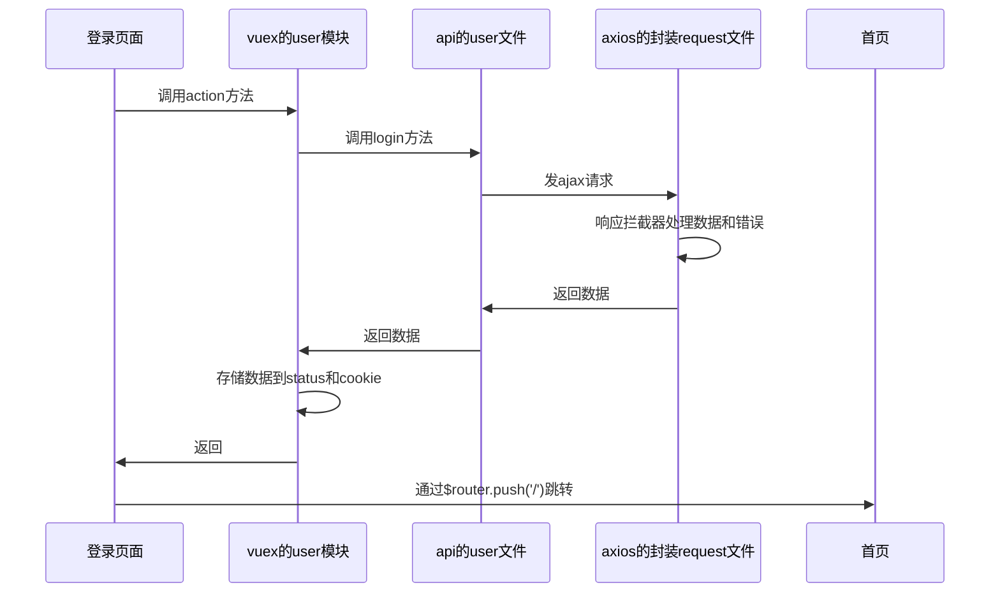

```mermaid
    sequenceDiagram
    登录页面 ->> vuex的user模块:调用action方法
    vuex的user模块 ->> api的user文件: 调用login方法
    api的user文件 ->> axios的封装request文件: 发ajax请求
    axios的封装request文件 ->> axios的封装request文件: 响应拦截器处理数据和错误
    axios的封装request文件 ->> api的user文件: 返回数据
    api的user文件 ->> vuex的user模块: 返回数据
    vuex的user模块 ->> vuex的user模块: 存储数据到status和cookie
    vuex的user模块 ->> 登录页面: 返回
    登录页面 ->> 首页: 通过$router.push('/')跳转
```